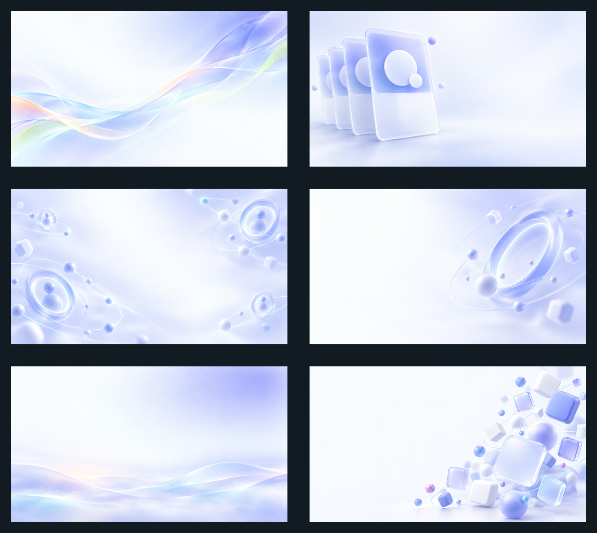
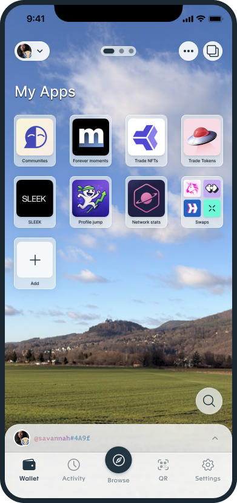
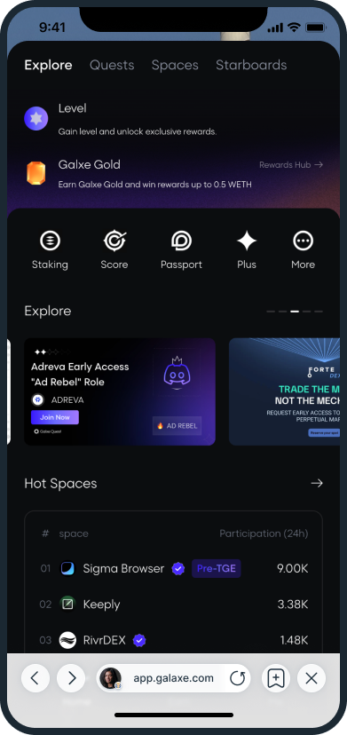
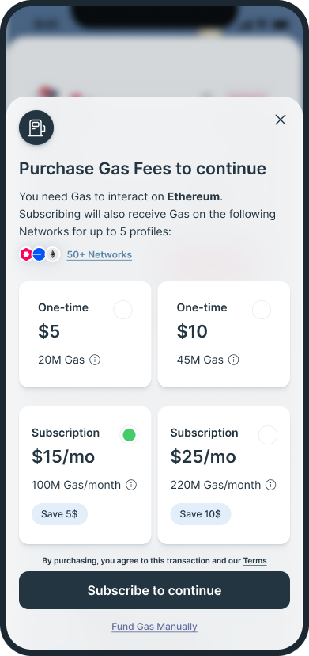
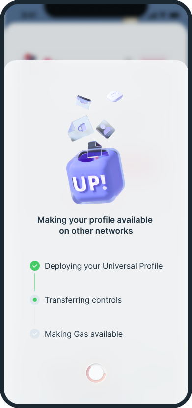
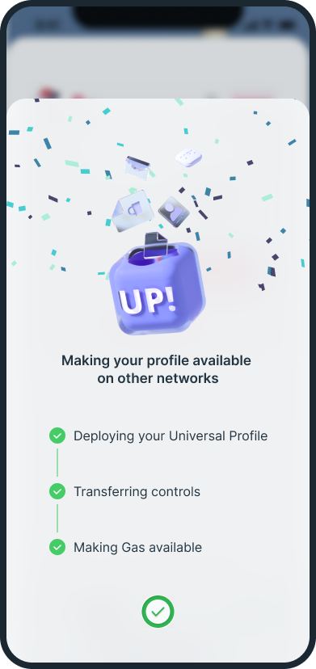
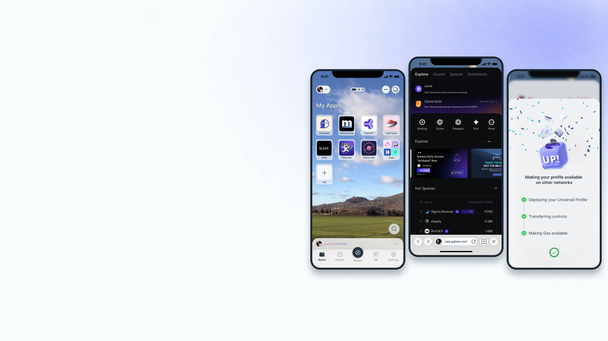

# Universal Profiles design system

<picture>
  <source media="(prefers-color-scheme: dark)" srcset="assets/generated/heroes/profile-passport-dark.png">
  
</picture>

The Universal Profiles product layer on top of the LUKSO base layer: tokens, foundations, component and pattern specifications, the Address Signature package, imagery and a validation gate that runs on Node alone. Built for product teams and for coding agents, with every value traced to evidence and labelled with its status.

Universal Profiles look like a calm, precise passport for the new web: a neutral canvas, Inter for words and PT Mono for anything that belongs to the chain, one periwinkle accent used as a frame, and at the centre of every surface the profile card carrying its Address Signature: the identicon badge, the `#XXXX` suffix and the gradient born from the address itself.

## Visual assets

Backgrounds for decks and titles, transparent app screens, the shipped onboarding art and ready-made previews, every file with a verified provenance record; the index is `assets/README.md`.

**Slide backgrounds** (proposed; six families, light and dark, plus the title pair; safe zones, crops and usage in [assets/generated/backgrounds/README.md](assets/generated/backgrounds/README.md)):

<picture>
  <source media="(prefers-color-scheme: dark)" srcset="assets/slides/previews/backgrounds-dark-overview.png">
  
</picture>

**App screens** (observed design-file exports with transparent exteriors; the paywall and deployment screens are an exploration, not shipped behaviour; [assets/screenshots/mobile-app/README.md](assets/screenshots/mobile-app/README.md)):

<p>
  
  
  
  
  
</p>

**Onboarding art** (observed shipped illustrations, copied from the mobile bundle at the audited commit; [assets/slides/README.md](assets/slides/README.md)):

<p>
  
  
  
  
</p>

**Slide preview** (a composition of the screens over the title background, with the recipe in the same README):

<picture>
  <source media="(prefers-color-scheme: dark)" srcset="assets/slides/previews/app-showcase-dark.png">
  
</picture>

## Status legend

| Status | Meaning |
|---|---|
| observed | Read from shipped code, approved collateral or a cited design file, unchanged |
| normalized | Derived from observed values by reconciling, rounding, renaming or extending a scale; derivation recorded |
| proposed | Introduced by this system; not in production and not formally approved |
| obsolete | Exists in evidence but must not be used in new work |
| open | Placeholder awaiting a decision; carries an `OPEN-nn` id in `provenance/open-items.md` |

Every token carries a status, a source key and a confidence; every document carries a `Status:` line and an evidence section.

## Source hierarchy

1. Current shipped mobile and web code and approved recent production behaviour.
2. Direct Universal Profile Board evidence, classified per node.
3. Focused current mobile design-file nodes where they align with shipped behaviour.
4. Approved public and campaign collateral.
5. Parent-brand ideation and older exploratory boards as lineage only.

Contradictions are never averaged; the newer authoritative source wins and the choice is logged in `provenance/reconciliation.md`. Private documents, renders, screenshots and temporary URLs are excluded from the repository and the validator scans for them.

## Quick start

Requires Node 22.13 or newer (the gate parses the generated TypeScript with the type stripper that arrived in 22.13) and git on the path (the gate reads the index so that files tracked despite `.gitignore` are validated, and proves in a throwaway repository that a forced add of a private file is rejected). Nothing to install.

```sh
npm test                                  # the full validation gate (tokens, build drift, contrast, docs, assets and raster contracts, forbidden content and its force-add mutation, sources, icons, examples, package tests)
node scripts/build-tokens.mjs             # regenerate tokens/build after editing tokens/src
node scripts/contrast-report.mjs          # regenerate accessibility/contrast-report.md
node scripts/generate-address-backgrounds.mjs   # regenerate the example backgrounds and share cards
node scripts/inspect-png.mjs assets/generated/backgrounds/title-light.png   # facts about a raster (hash, size, alpha, content credentials, safe-zone luminance)
```

Consume the tokens: `tokens/build/css/variables.css` on the web (plus `tokens/build/tailwind/preset.cjs` after the LUKSO preset), `tokens/build/react-native/theme.ts` in React Native, `tokens/build/json/tokens.flat.json` for tools. Consume the signature helpers from `packages/address-signature`. Guides: `adoption/web.md`, `adoption/react-native.md`.

## Map

| Path | Content |
|---|---|
| `CLAUDE.md`, `AGENTS.md` | The implementation contract for coding agents |
| `tokens/` | Token sources (DTCG JSON), contrast pairs, generated CSS, TypeScript, React Native, JSON, Tailwind preset and design-tool payloads |
| `foundations/` | Principles, colour, typography, spacing, shape, elevation and glass, motion, dark mode, responsive, the Address Signature, voice |
| `brand/` | Marks and lockups (observed, no masters), narrative, misuse, the relationship to LUKSO |
| `components/` | Fifteen specifications: button, input, controls, tag, list item, card, profile card (the UP Box), identicon, glass surfaces, overlays, navigation, app tile, QR and share cards, empty and error states, skeleton |
| `patterns/` | Onboarding, creation and recovery, permissions, signing, network context, wallet, apps and browser, discovery, empty and error flows, marketing layouts, content voice, the obsolete register |
| `packages/address-signature/` | Dependency-free helpers: checksum, gradient, suffix, display name, truncation, identicon, aura and share-card SVG, with tests and parity fixtures |
| `icons/` | The icon rules, a manifest and 53 original starter icons |
| `imagery/` | The two imagery families, twelve production briefs, framing and safe zones |
| `assets/` | The asset library: sixteen generated backgrounds and heroes, five transparent app screens, four shipped onboarding illustrations, four previews, procedural address-gradient examples and recipes, one provenance record per directory, the logos note |
| `accessibility/` | Rules, checklist and the generated contrast report |
| `adoption/` | Web and React Native guides, migration checklist, gap register |
| `provenance/` | Source register, open items, reconciliation register, provenance schema |
| `decisions/` | Decision records |
| `examples/` | Web and React Native examples, marketing recipes, agent playbooks |
| `scripts/` | Build, report, generator, the PNG inspector and the validation gate (with its dependency-free PNG reader and tests) |

## For Claude Code and other agents

Read `CLAUDE.md` first. In short: change values only in `tokens/src` and rebuild; render every profile with the Address Signature helpers; keep magenta for LUKSO network and LYX roles; never invent a mark; meet the accessibility gates; record provenance for every asset; pick backgrounds and screens from `assets/README.md` and keep copy inside the recorded safe zones; run `npm test` before finishing. `AGENTS.md` points other agents to the same contract.

## Governance

Versioning, review and release rules are in `GOVERNANCE.md`; contributions in `CONTRIBUTING.md`; licensing in `LICENSE`, `TRADEMARKS.md` and `LICENSES/`. Open decisions that need an owner are listed in `provenance/open-items.md`.
