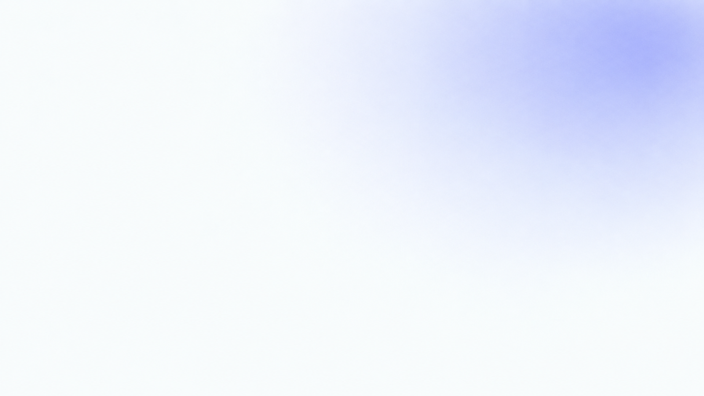
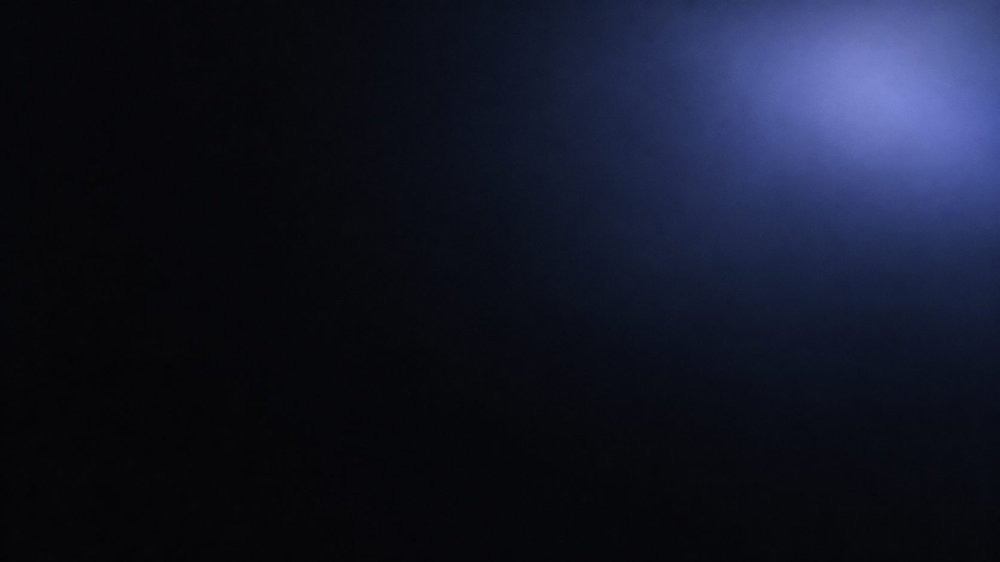
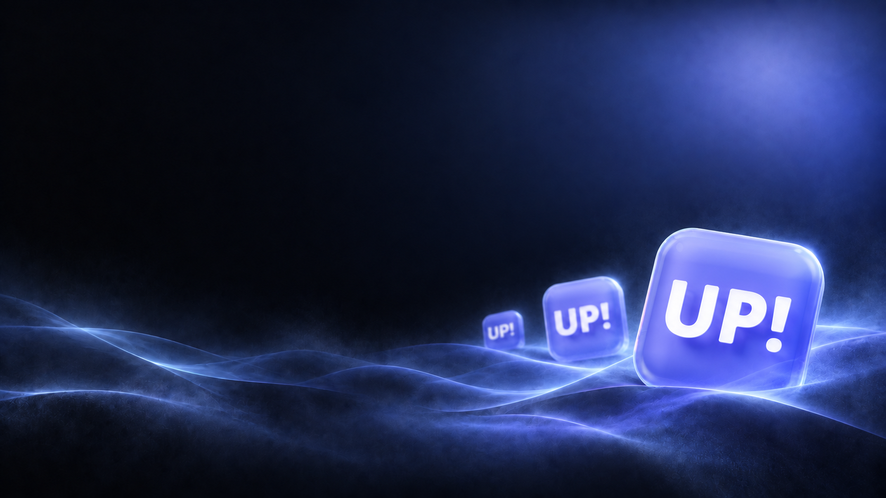

# Slide and background library

Status: proposed (generated for this system under recorded provenance; not approved brand imagery; the slide contract below is a system rule checked by the validator; the UP! box depicted in the slides-v2 files is an observed mark shown under the owner's recorded authorization, decision 0012)

Fourteen 16:9 backgrounds for decks, social titles and documentation: the quiet title pair (IB-10) in this directory and the six-family `slides-v2` set (IB-12) in `slides-v2/`, each family in a light and a dark register. Every slides-v2 file shows one or more official UP! boxes (the cube mark with the badge face) inside a generated scene; the title pair and the two heroes in `../heroes/` show blank objects only. Verbatim prompts, generation ids, reference inputs, hashes, dimensions, colour facts, content credentials and the measured text-safe zone of every file are in `../PROVENANCE.json`; the staged prompt file `slides-v2/PROMPTS.source.json` is kept byte-identical to those entries by the validator, and the whole branded selection is pinned in `../../../scripts/validate/branded-backgrounds.json` (`node scripts/validate.mjs --only branded`).

## Gallery

<picture>
  <source media="(prefers-color-scheme: dark)" srcset="../../slides/previews/backgrounds-dark-overview.png">
  
</picture>

Contact sheets: [light](../../slides/previews/backgrounds-light-overview.png), [dark](../../slides/previews/backgrounds-dark-overview.png), in alphabetical order, two columns by three rows, composed by `scripts/compose-previews.mjs`.

| Family | Light | Dark |
|---|---|---|
| Title (IB-10) |  |  |
| Address ribbons |  |  |
| Glass profile stack |  |  |
| Identity network |  |  |
| Identity orbits |  |  |
| Iridescent horizon |  |  |
| Modular constellation |  |  |

## Files and safe zones

Safe zones are fractions of the width and height, measured on the files (mean luminance and its standard deviation inside the zone) and recorded per file in the provenance record, where the validator re-measures them and compares the result with the recorded figures; the prompt's intent is given for comparison. The branded replacements kept the compositions of the generic files they replaced, so every zone is unchanged and was re-measured on the new pixels. Put titles and body copy inside the zone; anything outside it needs the glass tier or a solid tint behind text, and copy never runs over a UP! box.

| Family | File pair | Subject sits | Text-safe zone (x, y, width, height) | Prompt intent | Measured light | Measured dark |
|---|---|---|---|---|---|---|
| Title | `title-light.png`, `title-dark.png` | Bloom upper right | 0, 0, 0.55, 1 (left 55 percent) | left 55 percent quiet | 250, deviation 3 | 9, deviation 4 |
| Identity orbits | `slides-v2/identity-orbits-*.png` | Right half from 53 percent: three UP! boxes in the orbit system | 0, 0, 0.5, 1 (left half) | left 52 percent text-safe | 250, deviation 4 | 8, deviation 5 |
| Glass profile stack | `slides-v2/glass-profile-stack-*.png` | Left half to 49 percent: three UP! boxes on the card stack | 0.5, 0, 0.5, 1 (right half) | right 50 percent text-safe | 241, deviation 8 | 19, deviation 6 |
| Address ribbons | `slides-v2/address-ribbons-*.png` | Lower left and upper right: four UP! boxes on the ribbons | 0.15, 0.15, 0.5, 0.35 (centre-left band) | band 15 to 65 by 15 to 50 percent | 245, deviation 8 | 22, deviation 11 |
| Modular constellation | `slides-v2/modular-constellation-*.png` | Lower right: five UP! boxes among blank cubes, tiles and spheres | 0, 0, 0.58, 0.5 (upper left) | upper-left 58 by 50 percent text-safe | 248, deviation 1 | 24, deviation 8 |
| Identity network | `slides-v2/identity-network-*.png` | Corners and edges: five UP! boxes on orbital paths | 0.3, 0, 0.4, 0.75 (centre column) | centre column 30 to 70 percent, upper 75 percent | 243, deviation 10 | 18, deviation 7 |
| Iridescent horizon | `slides-v2/iridescent-horizon-*.png` | Lower right: three UP! boxes on the wave forms, glow upper right | 0, 0, 0.6, 0.5 (upper left) | upper 65 percent text-safe | 246, deviation 7 | 11, deviation 7 |

Luminance is 0 to 255. Every file is 1672 by 941 (two dark files, identity network and identity orbits, are 1671 by 941), 8-bit RGB without an alpha channel, the generator's native output; 1920 by 1080 masters have not been produced.

## Light and dark

- **Light register** for ink copy: `text.default` (the light ink) on a safe zone that measures at least 200; headline `type.deck.h1`, body `type.deck.body`, one accent phrase in `accent.brand`.
- **Dark register** for white copy: `text.default` of the dark theme (the canvas white) on a safe zone that measures at most 64; the accent phrase uses the dark brand step (`color.up.73`, which `accent.brand` resolves to in the dark theme).
- Pair by family: a deck uses one family per section and switches register with the theme, the way the README hero switches with `prefers-color-scheme`.
- Do not tint a light file to make it dark or the reverse; the pair exists for that.
- Secondary text never sits on the busy area: outside the safe zone use the glass panel (`glass-panel` in the components tier) or a solid `surface.card` tint behind the text, per the luminance rule in `../../../foundations/elevation-and-glass.md`.

## Crop and composition

- **Native 16:9** covers a 1920 by 1080 slide with a 15 percent upscale; use "scale to fill", never stretch. For 3840 by 2160 output, regenerate rather than upscale.
- **4:3 (1254 by 941)** and **1:1 (941 by 941)**: keep the side the subject sits on when the image is the point (identity orbits: right; glass profile stack: left; modular constellation: right; iridescent horizon: full width, anchored to the bottom; address ribbons and identity network: centre) and the opposite side when the copy is the point. A crop keeps the scene around the boxes; never crop down to a box so that it reads as a mark on its own.
- **9:16 stories (529 by 941)**: identity network and iridescent horizon crop best (centre and bottom-anchored); the others lose their subject, so use the aura background from `packages/address-signature` instead.
- **Link previews (1200 by 630)**: the title pair or the heroes; the slides-v2 families are too detailed at that size.
- Keep 6 percent margins; page numbers bottom right; the tracked label top left in `type.deck.caption`; the lockup, when used, from official files only and never over the subject. The depicted boxes do not replace the lockup: a slide that needs the mark as a mark uses the official files.
- The showcases in `../../slides/previews/` are worked compositions: three app screens at 299 by 634 on the right half of the title background, the left half free for copy.

## Usage

Deck software: set the file as the slide background (Keynote: Format, Background, Image Fill, Scale to Fill; PowerPoint: Format Background, Picture fill; Google Slides: Background, Choose image), then place text in the safe zone.

Web or documentation:

```html
<picture>
  <source media="(prefers-color-scheme: dark)" srcset="assets/generated/backgrounds/slides-v2/identity-orbits-dark.png">
  
</picture>
```

```css
.deck-title {
  background: var(--up-surface-canvas) url("assets/generated/backgrounds/slides-v2/identity-orbits-light.png") center / cover no-repeat;
  color: var(--up-text-default);
  padding: 6%;
  max-width: 50%; /* the identity-orbits safe zone */
}
@media (prefers-color-scheme: dark) {
  .deck-title { background-image: url("assets/generated/backgrounds/slides-v2/identity-orbits-dark.png"); }
}
```

Alt text: describe the picture when it carries meaning (the gallery table above has one line per file, naming the UP! boxes); an empty `alt` when it is decoration behind copy.

## Authority and status

| Item | Status | Meaning |
|---|---|---|
| The fourteen files | proposed | Original generated imagery for this system; not in production and not approved brand imagery |
| The UP! box shown in the twelve slides-v2 files | observed reference, owner-authorized depiction | Rendered by the generator from the official 3D UP! box on the brand board (SRC-FIGMA-UP-BOARD node 1131:25142, Box 5a) at the owner's request; a publication and use decision for these files, not brand approval and not a mark file (`../../../decisions/0012-branded-slide-backgrounds.md`); the standalone reference is not published |
| Safe zones | proposed, measured | Declared per file from the prompt and confirmed by measurement; the validator re-measures them and compares with the recorded figures |
| The slide contract | proposed | A system rule: 16:9 within 1 percent, at least 1600 by 900, 8-bit RGB, no alpha, intact content credentials, a light and a dark file per family, safe-zone luminance at least 200 (light) or at most 64 (dark) with a deviation of at most 20; the thresholds are pinned in the branded fixture |
| Prompts | observed | Verbatim in `slides-v2/PROMPTS.source.json` and the provenance record, with the generation id and the former file's hash per entry; pinned by hash in `scripts/validate/branded-backgrounds.json` |
| Box counts per file | observed by visual review | Three, three, four, five, five and three per family (light and dark alike), counted at integration; the validator cannot count glyphs and does not claim to |

Every file carries a C2PA content-credentials manifest signed by OpenAI (software agent `gpt-image 2.0`); the manifest and the invisible watermark stay intact, and tools that read content credentials will identify the images as AI-generated. Licence: `../../../LICENSES/GENERATED-IMAGES.md`. The earlier generic set's request for "tiny controlled magenta and cyan accents" (modular constellation) is gone with those prompts; the replacement prompts ask for no pink and no magenta.

## Publication boundary

These files are public and may be reused under the repository licence as whole backgrounds. They are backgrounds, not marks: the UP! mark remains a trademark of its owner and is not licensed for extraction or standalone reuse. Do not crop a box out, trace it, vectorise it, use it as a logo, icon, sticker, lockup or app icon, alter it, or present it as an official mark file; do not edit a background into a logo, place it behind a mark reconstruction or present it as a product screenshot. The reference the generator followed was a private board export cited by node id and hash; the standalone reference is not published, and no other mark master, render or export enters the repository (`../../../decisions/0010-no-reconstruction-under-any-label.md`, OPEN-03). New members must be generated (never traced from private board renders), carry a provenance entry with the prompt and hash, and pass the contract; see `../../../imagery/briefs.md` (IB-12).

## Adding variations

1. Reuse a family prompt from `slides-v2/PROMPTS.source.json` (change only the primary request and the composition line) or write a new family inside the IB-12 frame; generate the light file, then the dark companion from the same description. A variation that shows a mark needs its own recorded owner authorization and a decision record before it enters the repository; decision 0012 covers the twelve pinned files only. Without that authorization, keep the generic frame: no other words, letters or marks than what the brief allows.
2. Keep the native output; do not upscale, crop or strip the manifest.
3. Name the pair `<family>-light.png` and `<family>-dark.png`, put them in `slides-v2/` (or a new set directory) and add the prompts to `PROMPTS.source.json` there.
4. Run `node scripts/inspect-png.mjs slides-v2/<family>-light.png --zone 0,0,0.5,1` to get the hash, dimensions, content-credentials timestamp and the luminance of the intended safe zone; adjust the zone until it measures light or dark enough and quiet, then add both entries to `../PROVENANCE.json` (`set`, `family`, `register`, `status: "proposed"`, `safeZone` with its `measured` figures, `prompt`, `brief`, and for an authorized branded file the `generation` inputs and `embeddedMarks`) and raise the set's `count` and `families`.
5. Recompose the contact sheets with `node scripts/compose-previews.mjs` (or add a new sheet) and record the placements and hashes in `../../slides/previews/PROVENANCE.json`; extend the pinned selection in `scripts/validate/branded-backgrounds.json` when a branded file is added; `node scripts/validate.mjs --only rasters` and `--only branded` must pass, then `npm test`.
