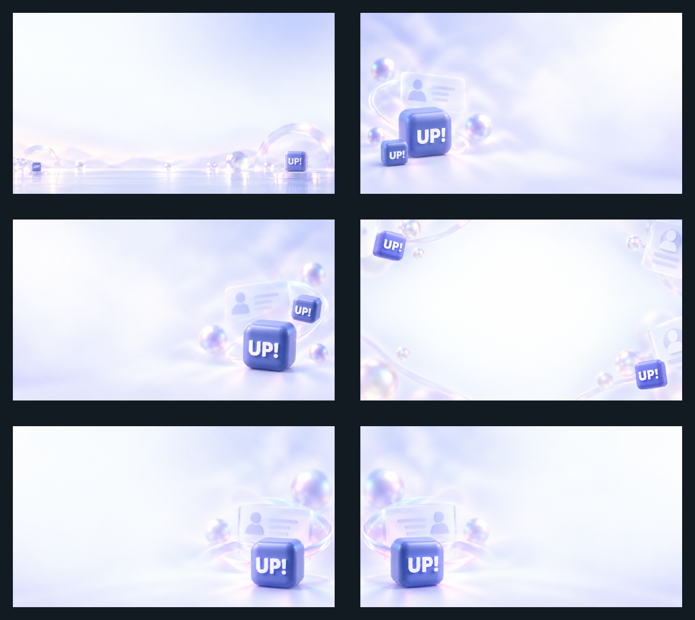

# Slides: onboarding art and previews

Status: observed for the onboarding illustrations (shipped product art, unchanged); proposed for the previews (compositions of repository files)

Two directories for deck work: `onboarding/` holds the four illustrations the shipped app uses in its get-started carousel, copied byte for byte from the mobile bundle; `previews/` holds six compositions made only from recorded repository files, for the README galleries and for choosing backgrounds.

## Onboarding art

| Slide | File | Size | Alt text |
|---|---|---|---|
| 1 |  | 1080 by 838 | First get-started illustration of the shipped app |
| 2 |  | 1000 by 996 | Second get-started illustration of the shipped app |
| 3 |  | 1000 by 1000 | Third get-started illustration of the shipped app |
| 4 |  | 1000 by 1000 | Fourth get-started illustration of the shipped app |

- **What they are:** the files `assets/image/get-started-1.png` to `get-started-4.png` of the mobile application at the audited commit `8d8f9f8c` (version 1.29.0, `SRC-MOBILE-APP`), verified by hash; 8-bit RGBA with transparent backgrounds and the margins the bundle ships. Nothing here was generated, edited, scaled or re-encoded.
- **Status:** observed shipped product art. It shows the app as it is; it is not new work of this repository and not the source for new illustration. The soft-object family is regenerated under recorded provenance from `../../imagery/briefs.md`; IB-04 proposes the refreshed set that replaces these slides, and the gap register notes the shipped set's magenta bleed and rocket metaphor.
- **Rights:** third-party project assets. The mobile repository carries the Apache License 2.0 with the notice "Copyright 2023 LUKSO Blockchain GmbH"; the illustration files carry no separate notice and their illustrator or generator is not recorded there. They are republished at the product owner's request (`../../decisions/0011-owner-authorized-product-visuals.md`); this repository adds no licence of its own and OPEN-04 stays open for the rights statement. See `../../LICENSES/THIRD-PARTY.md`.
- **Use:** decks and documentation about the shipped onboarding (`../../patterns/onboarding.md`), store-style frames of the shipped app. Place them over `surface.canvas` or a light background from `../generated/backgrounds/`; keep the transparent background; do not recolour, crop the objects or combine them into a mark. Slides 2, 3 and 4 were supplied as style and composition references for the twelve expressive slides-v2 backgrounds (recorded by hash under decision 0013); they were not edited and nothing was copied from them. The ambient set instead uses recorded repository backgrounds as references.

## Previews

<picture>
  <source media="(prefers-color-scheme: dark)" srcset="previews/app-showcase-dark.png">
  
</picture>

<picture>
  <source media="(prefers-color-scheme: dark)" srcset="previews/ambient-backgrounds-dark-overview.png">
  
</picture>

| File | Size | What it shows | Inputs |
|---|---|---|---|
| `previews/app-showcase-light.png` | 1920 by 1080 | Three app screens on the right half of the light title background, the in-app browser raised; the left half free for ink copy | `../generated/backgrounds/title-light.png`; `../screenshots/mobile-app/app-home.png`, `in-app-browser.png`, `deployment-success.png` at 299 by 634 |
| `previews/app-showcase-dark.png` | 1920 by 1080 | The same over the dark title background, for white copy | the dark title file and the same screens |
| `previews/backgrounds-light-overview.png` | 1296 by 1158 | Contact sheet of the six light slide backgrounds, each a layered identity collage showing one or more solid closed official UP! container cubes | the six `slides-v2/*-light.png` files area-averaged to 600 by 338, two columns by three rows, 24 pixel margins, 48 pixel gutters, on the dark canvas; composed by `scripts/compose-previews.mjs` |
| `previews/backgrounds-dark-overview.png` | 1296 by 1158 | Contact sheet of the six dark slide backgrounds, each a layered identity collage showing one or more solid closed official UP! container cubes | the six `slides-v2/*-dark.png` files, same grid and script |
| `previews/ambient-backgrounds-light-overview.png` | 1296 by 1158 | Contact sheet of the six light ambient backgrounds, each a subordinate edge-biased scene showing one or two solid closed official UP! container cubes | the six `slides-v3-ambient/*-light.png` files, same deterministic grid and script |
| `previews/ambient-backgrounds-dark-overview.png` | 1296 by 1158 | Contact sheet of the six dark ambient backgrounds, each a subordinate edge-biased scene showing one or two solid closed official UP! container cubes | the six `slides-v3-ambient/*-dark.png` files, same deterministic grid and script |

The expressive order is alphabetical: address ribbons, glass profile stack, identity network, identity orbits, iridescent horizon, modular constellation. The ambient order is also alphabetical: distant horizon, mist orbit left, mist orbit right, peripheral frame, quiet corner, quiet corner left.

- **How they are checked:** `previews/PROVENANCE.json` records every input and integer placement, and `node scripts/validate.mjs --only rasters` measures each composition. `--only branded` independently pins and recomposes the two expressive sheets; `--only ambient` independently pins and recomposes the two ambient sheets. Both require identical pixels, grid and hashes without broadening the other lock. A preview that stops matching its inputs fails the gate.
- **Status:** proposed; derived material that inherits the licences of its inputs. All four overview sheets contain generated-background pixels only and follow `../../LICENSES/GENERATED-IMAGES.md`. The expressive sheets inherit the same restriction as their inputs under decision 0012 (`../../decisions/0012-branded-slide-backgrounds.md`) and decision 0013 (`../../decisions/0013-container-cube-slide-backgrounds.md`); decision 0014 covers exactly the twelve ambient scenes and their two sheets. In every sheet the mark stays its owner's trademark and may not be extracted, cropped out, traced or reused as a mark; decision 0014 grants no extraction or trademark licence. The two app-showcase previews remain mixed works subject to the screen record. Use previews to choose files, not as delivery masters.
- **Regenerating:** run `node scripts/compose-previews.mjs` (dependency-free; canvas `#121B21`, thumbnails area-averaged, 8-bit RGB output). The script preserves committed bytes when decoded pixels already equal a fresh composition; encoded bytes can differ between Node lines because their zlib versions differ, while the pixels remain deterministic. Paste a newly written sheet's hash into the preview record and its matching branded or ambient fixture, then run `--check`. The showcases follow the recipe below.

## Composition recipe (showcase)

1. Scale the title background to 1920 by 1080.
2. Place three screens at 299 by 634: x 980, 1290 and 1600; y 219 for the outer two and 179 for the middle one (raised 40 pixels).
3. Add a soft shadow under the screens on the light register.
4. Copy goes in the left half: headline in `type.deck.h1`, one accent phrase in `accent.brand`, body in `type.deck.body`.
